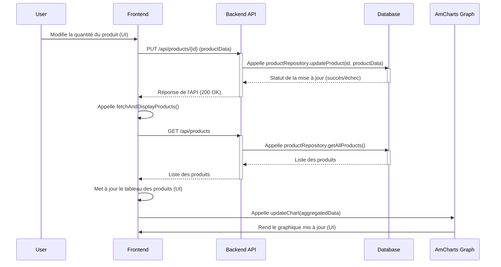

# Projet de Gestion de Produits

Ce projet est une application web complète (full-stack) pour la gestion d'un inventaire de produits. Il comprend une API backend construite avec Node.js et Express, et une interface frontend interactive pour la visualisation et la manipulation des données.

## Fonctionnalités

### Backend
- **API RESTful** pour les opérations CRUD (Create, Read, Update, Delete) sur les produits.
- **Base de données SQLite** avec l'ORM Sequelize pour une gestion robuste des données.
- **Documentation d'API interactive** avec Swagger, accessible sur `/api-docs`.
- **Structure en couches** suivant les meilleures pratiques (Repository, Service, Controller).

### Frontend
- **Dashboard interactif** pour visualiser la liste des produits.
- **Ajout, modification et suppression** de produits via une interface modale.
- **Graphique dynamique** (propulsé par amCharts 5) montrant la répartition du stock par catégorie.
- **Communication asynchrone** avec le backend via Axios.
- **Interface responsive** construite avec Bootstrap 5.

## Stack Technique

- **Backend**:
  - Node.js
  - Express.js
  - Sequelize
  - SQLite3
  - Cors, Dotenv
- **Frontend**:
  - HTML5
  - Bootstrap 5
  - Axios
  - amCharts 5
- **Documentation**:
  - Swagger UI
  - Mermaid (pour les diagrammes)

## Installation et Lancement

### Prérequis
- Node.js (version 14 ou supérieure)
- npm

### 1. Cloner le dépôt (si ce n'est pas déjà fait)
```bash
git clone https://github.com/said-externekhalifa-cloud/BMAD_Method_sample.git
cd BMAD_Method_sample
```

### 2. Installer les dépendances
```bash
npm install
```

### 3. Lancer le serveur
```bash
node index.js
```
Le serveur backend démarrera sur `http://localhost:3000`.

### 4. Accéder à l'application
- **Frontend**: Ouvrez le fichier `frontend/index.html` directement dans votre navigateur.
- **Documentation de l'API**: Accédez à `http://localhost:3000/api-docs`.

## Structure du Projet
```
products_project/
├── frontend/
│   ├── js/
│   │   ├── api.js       # Client API Axios
│   │   ├── app.js       # Logique principale du frontend
│   │   └── charts.js    # Configuration du graphique amCharts
│   ├── index.html     # Page principale du frontend
│   └── update_flow.mmd # Diagramme de séquence
├── node_modules/
├── src/
│   ├── config/
│   │   ├── database.js  # Configuration Sequelize
│   │   └── swagger.js   # Configuration Swagger
│   ├── controllers/
│   │   └── productController.js
│   ├── models/
│   │   └── Product.js
│   ├── repositories/
│   │   └── productRepository.js
│   ├── routes/
│   │   └── productRoutes.js
│   └── services/
│       └── productService.js
├── .gitignore
├── database.sqlite      # Fichier de la base de données
├── index.js             # Point d'entrée du serveur
├── package-lock.json
└── package.json
```

## Flux de Mise à Jour (Diagramme de Séquence)

Voici le flux de données lors de la modification d'un produit depuis l'interface utilisateur.


